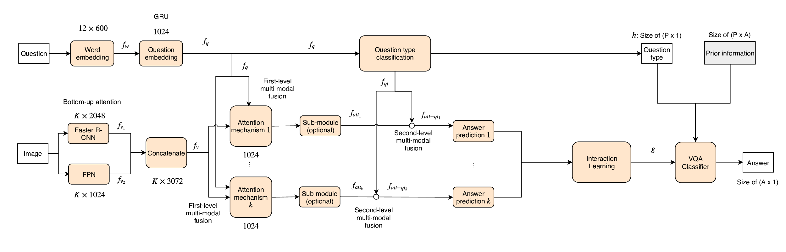

# Multiple interaction learning with question-type prior knowledge for constraining answer search space in visual question answering

This repository is the implementation of [Multiple interaction learning with question-type prior knowledge for constraining answer search space in visual question answering](https://arxiv.org/abs/2009.11118) for the visual question answering task. Our single model achieved **70.93** (Test-standard, VQA 2.0). Moreover, in TDIUC dataset, our single model achieved **73.04** in Arithmetic MTP metric and **66.86** in Harmonic MTP metric.

This repository is based on and inspired by @hengyuan-hu's [work](https://github.com/hengyuan-hu/bottom-up-attention-vqa) and @kim's [work](https://github.com/jnhwkim/ban-vqa). We sincerely thank for their sharing of the codes.

### Summary

* [The proposed framework](#the-proposed-framework)
* [Prerequisites](#prerequisites)
* [Preprocessing](#preprocessing)
* [Training](#training)
* [Validation](#validation)
* [Citation](#citation)
* [License](#license)
* [More information](#more-information)

### The proposed framework 


### Prerequisites

You may need a machine with 1 GPUs, at least 11GB memory, and PyTorch v0.4.1 for Python 3.6.

1. Install [PyTorch](http://pytorch.org/) with CUDNN v7.1, CUDA 9.2 and Python 3.6.
2. Install [h5py](http://docs.h5py.org/en/latest/build.html).

##### Installing MILQT necessary libraries

Python3

Please install dependence package by run following command:

```
pip install -r requirements.txt
```

### Preprocessing

All data should be downloaded to a `data/` directory in the root directory of this repository.

The easiest way to download the data is to run the provided script `tools/download.sh` from the repository root. If the script does not work, it should be easy to examine the script and modify the steps outlined in it according to your needs. Then run `tools/process.sh` from the repository root to process the data to the correct format.

Our model is required to apply a Mixture of Detection features of Faster R-CNN and FPN as input image features to reach best performance, the image features can be found in [here](https://vision.aioz.io/d/cba41d0bdacc43ee9fe1/files/?p=/MoD.zip&dl=1) which should be extracted and placed in `data/MoD/`.
Our implementation also uses the pretrained features from [bottom-up-attention](https://github.com/hengyuan-hu/bottom-up-attention-vqa).
The introducted image features have 10-100 adaptive features per image.

For now, you should manually download for the below options (used in our best single model).

We use a part of Visual Genome dataset for data augmentation. The [image meta data](https://visualgenome.org/static/data/dataset/image_data.json.zip) is needed to be placed in `data/`.

We use MS COCO captions to extract semantically connected words for the extended word embeddings along with the questions of VQA 2.0 and Visual Genome. You can download in [here](http://images.cocodataset.org/annotations/annotations_trainval2017.zip).

Counting module ([Zhang et al., 2018](https://openreview.net/forum?id=B12Js_yRb)) is integrated in this repository as `counting.py` for your convenience. The source repository can be found in @Cyanogenoid's [vqa-counting](https://github.com/Cyanogenoid/vqa-counting).

### Training

```
$ python3 main.py --use_MoD --MoD_dir data/MoD/ --batch_size 64 --update_freq 4 --lr 7e-4 --comp_attns BAN_COUNTER,BAN,SAN --output saved_models/MILQT --use_counter --use_both --use_vg
```
to start training (the options for the train/val splits and Visual Genome to train, respectively). The training scores will be printed every epoch, and the best model will be saved under the directory "saved_models". The default hyper-parameters should give you the best result of single model, which is around **70.62** for test-dev split.

### Validation

If you trained a model with the training split using
```
$ python3 main.py --use_MoD --MoD_dir data/MoD/ --batch_size 64 --update_freq 4 --lr 7e-4 --comp_attns BAN_COUNTER,BAN,SAN --output saved_models/MILQT --use_counter
```
then you can run `evaluate.py` with appropriate options to evaluate its score for the validation split.

##### Pretrained model

We provide the pretrained model reported as the best single model in the paper (70.62 for test-dev, 70.93 for test-standard).

Please download the [pretrained_model](https://vision.aioz.io/d/39b01e88bf7141ab92f5/files/?p=/MILQT/model_epoch12.pth&dl=1) and move to `saved_models/MILQT/model_epoch12.pth`. The training log is found in [here](https://vision.aioz.io/d/39b01e88bf7141ab92f5/files/?p=/MILQT/log.txt&dl=1).

```
$ python3 test.py --use_MoD --MoD_dir data/MoD/ --batch_size 64 --comp_attns BAN_COUNTER,BAN,SAN --input saved_models/MILQT --use_counter
```

The result json file will be found in the directory `results/`.

### Citation

If you use this code as part of any published research, we'd really appreciate it if you could cite the following paper:

```
@misc{do2020multiple,
      title={Multiple interaction learning with question-type prior knowledge for constraining answer search space in visual question answering},
      author={Tuong Do and Binh X. Nguyen and Huy Tran and Erman Tjiputra and Quang D. Tran and Thanh-Toan Do},
      year={2020},
      eprint={2009.11118},
      archivePrefix={arXiv},
      primaryClass={cs.CV}
}
```

### License

AIOZ License

### More information

AIOZ AI Homepage: https://ai.aioz.io
